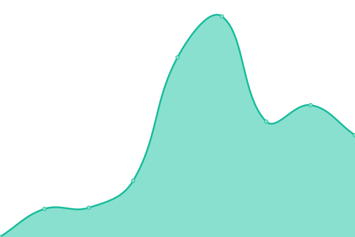
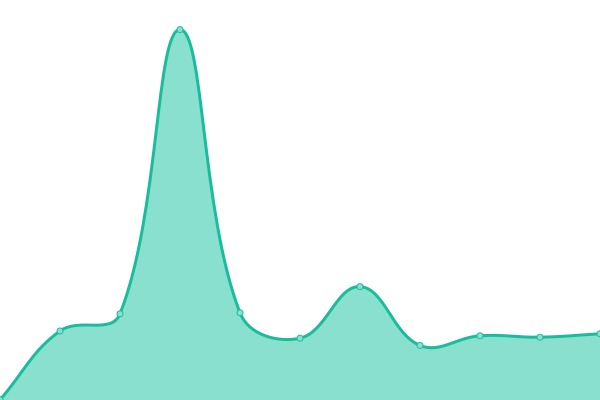

# [📈 Live Status](https://status.pacabisjere.me): <!--live status--> **🟥 Complete outage**

This repository contains the open-source uptime monitor and status page for [Jeremy Patrick Pacabis](https://status.pacabisjere.me), powered by [Upptime](https://github.com/upptime/upptime).

With [Upptime](https://upptime.js.org), you can get your own unlimited and free uptime monitor and status page, powered entirely by a GitHub repository. We use [Issues](https://github.com/73R3WY/upptime-jer/issues) as incident reports, [Actions](https://github.com/73R3WY/upptime-jer/actions) as uptime monitors, and [Pages](https://status.pacabisjere.me) for the status page.

<!--start: status pages-->
<!-- This summary is generated by Upptime (https://github.com/upptime/upptime) -->
<!-- Do not edit this manually, your changes will be overwritten -->
<!-- prettier-ignore -->
| URL | Status | History | Response Time | Uptime |
| --- | ------ | ------- | ------------- | ------ |
|  ISIP | 🟥 Down | [isip.yml](https://github.com/73R3WY/upptime-jer/commits/HEAD/history/isip.yml) | 

 449ms
     
 | 

<a href="https://status.pacabisjere.me/history/isip">0.00%</a>
    

|  ISIP-Dev | 🟥 Down | [isip-dev.yml](https://github.com/73R3WY/upptime-jer/commits/HEAD/history/isip-dev.yml) | 

 567ms
     
 | 

<a href="https://status.pacabisjere.me/history/isip-dev">0.00%</a>
    

|  Personal Site | 🟥 Down | [personal-site.yml](https://github.com/73R3WY/upptime-jer/commits/HEAD/history/personal-site.yml) | 

 0ms
     
 | 

<a href="https://status.pacabisjere.me/history/personal-site">0.00%</a>
    

<!--end: status pages-->

[**Visit our status website →**](https://status.pacabisjere.me)

## 📄 License

- Powered by: [Upptime](https://github.com/upptime/upptime)
- Code: [MIT](./LICENSE) © [Anand Chowdhary](https://anandchowdhary.com), supported by [Pabio](https://pabio.com)
- Data in the `./history` directory: [Open Database License](https://opendatacommons.org/licenses/odbl/1-0/)
